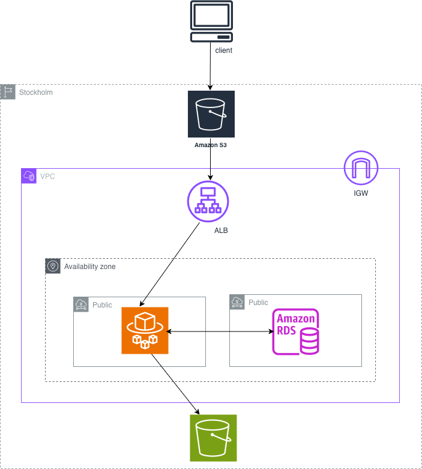
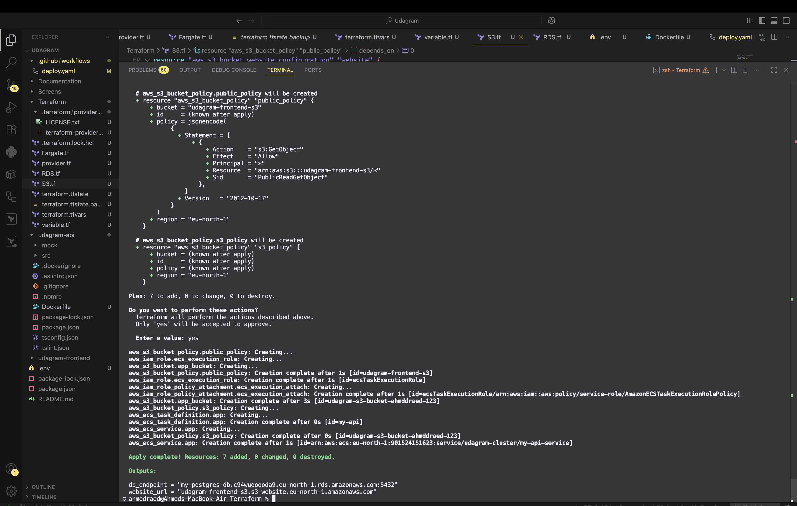
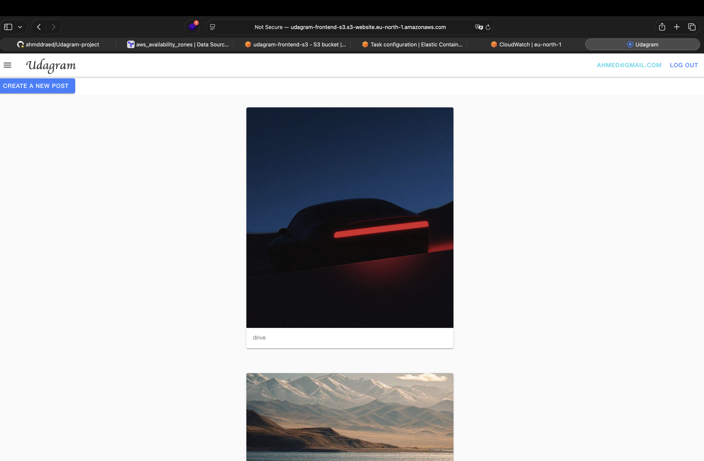
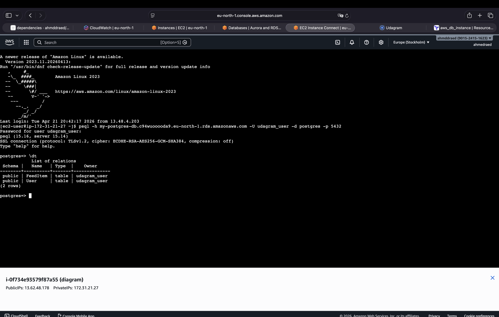
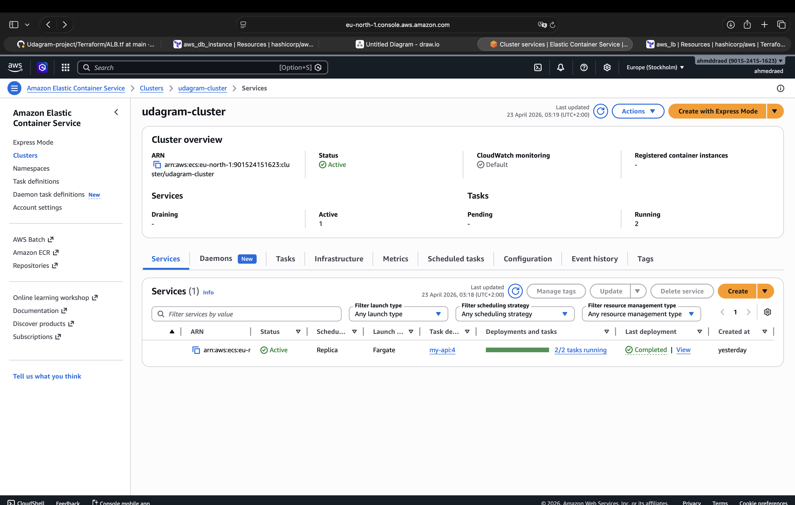
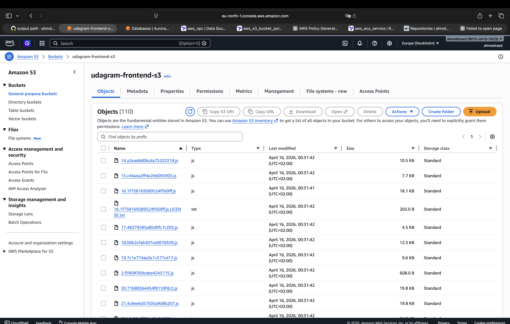

# Udagram

This project demonstrates a full cloud deployment of the Udagram Full-stack application using AWS infrastructure provisioned with Terraform and complete CICD pipeline automation with GitHubActions

## Accessing the website
the deployed website can be found from [Press_here](udagram-frontend-s3.s3-website.eu-north-1.amazonaws.com).


### Archeticture
1. Amazon ECS (Fargate): Run containers (2 replicas) without managing servers
1. Application Load Balancer (ALB): To route the traffic to Fargate
1. Amazon RDS (PostgreSQL): Managed relational database
1. Amazon S3: Store application assets
1. S3 Static Website Hosting : Serve frontend
1. IAM Roles: Manage permissions
1. Security Groups: Control network traffic



## Getting Started

1. Clone this repo locally into the location of your choice.
1. Configure your AWS credintials through ~/.aws/configure 
1. go to Terrafom Folder 
1. initialize terraform by $ terraform init
1. Preview the infrastructure by $ terraform plan & apply with $ terraform apply  



### Dependencies

```
- AWS CLI v2, v1 can work but was not tested for this project

- Terraform

all the project dependencies will be built and installed during the pipeline and through the ECS fargate

```

## OutPuts 

After provisioning the infrastucture, Terraform will display these OutPuts:

1. database Endpoint 
1. Frontend URL
1. ALB DNS

## Application Screenshot



# jump into database



# Fargate



# s3 hosting frontend 




